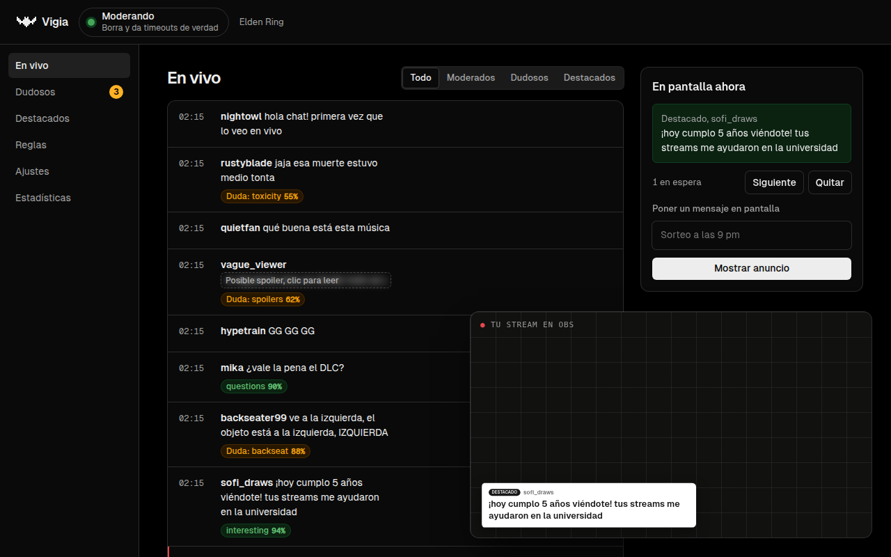

# Vigia

[English](README.md) · [Sitio web](https://vstrofago.github.io/vigia/) · [Docs](https://vstrofago.github.io/vigia/docs/) · [Playground](https://vstrofago.github.io/vigia/playground/)

Vigia modera el chat de tu stream de Twitch. Corre en tu propia computadora y es gratis y open source.

- **Modera:** borra spam y da timeouts por insultos. Si no está seguro, deja el mensaje para que decida un mod.
- **Oculta spoilers** del juego que estás jugando, también en tu propio dashboard.
- **Destaca preguntas y buenos mensajes** en un overlay de OBS.

Cada mensaje lo revisa Jev, un modelo de [TypeSafe AI](https://typesafe.ai) que responde preguntas de sí o no con una probabilidad. Tus umbrales deciden qué pasa.



> [!WARNING]
> **Experimental (v0.1.0).** Espera errores y cambios que rompan cosas.
> - Empieza en **modo observación** y no uses Vigia como tu única moderación todavía.
> - Los instaladores **no están firmados**, así que Windows y macOS muestran un aviso.

## Instalar

Descarga la app de escritorio para Windows, macOS o Linux desde [Releases](https://github.com/vstrofago/vigia/releases). Una ventana te guía en la configuración en unos diez minutos.

Necesitas una key de Jev (el uso cuesta centavos por noche). Para moderar tu canal, también tu propia app de Twitch, que es gratis. [Cómo conseguirlas](https://vstrofago.github.io/vigia/docs/keys/).

Otras formas de correrlo: [Docker](https://vstrofago.github.io/vigia/docs/docker/), [un servidor para tus mods](https://vstrofago.github.io/vigia/docs/server/) o [la línea de comandos](https://vstrofago.github.io/vigia/docs/cli/).

## Docs

- [Cómo decide](https://vstrofago.github.io/vigia/docs/how-it-works/)
- [Reglas](https://vstrofago.github.io/vigia/docs/rules/)
- [Anti-spoiler](https://vstrofago.github.io/vigia/docs/anti-spoiler/)
- [Comandos del chat](https://vstrofago.github.io/vigia/docs/commands/)
- [Overlay de OBS](https://vstrofago.github.io/vigia/docs/overlay/)
- [Privacidad](https://vstrofago.github.io/vigia/docs/privacy/)
- [Preguntas frecuentes](https://vstrofago.github.io/vigia/docs/faq/)

Los docs viven en [`apps/docs`](apps/docs). Para verlos en tu equipo: `pnpm docs`.

## Desarrollo

```bash
pnpm install
pnpm test
pnpm typecheck
pnpm --filter @vigia/desktop start      # la app de escritorio desde el código
```

Más en [Desarrollo](https://vstrofago.github.io/vigia/docs/develop/). Reglas, packs de spoilers, traducciones y código son bienvenidos: mira [CONTRIBUTING.md](CONTRIBUTING.md).

## Licencia

MIT
