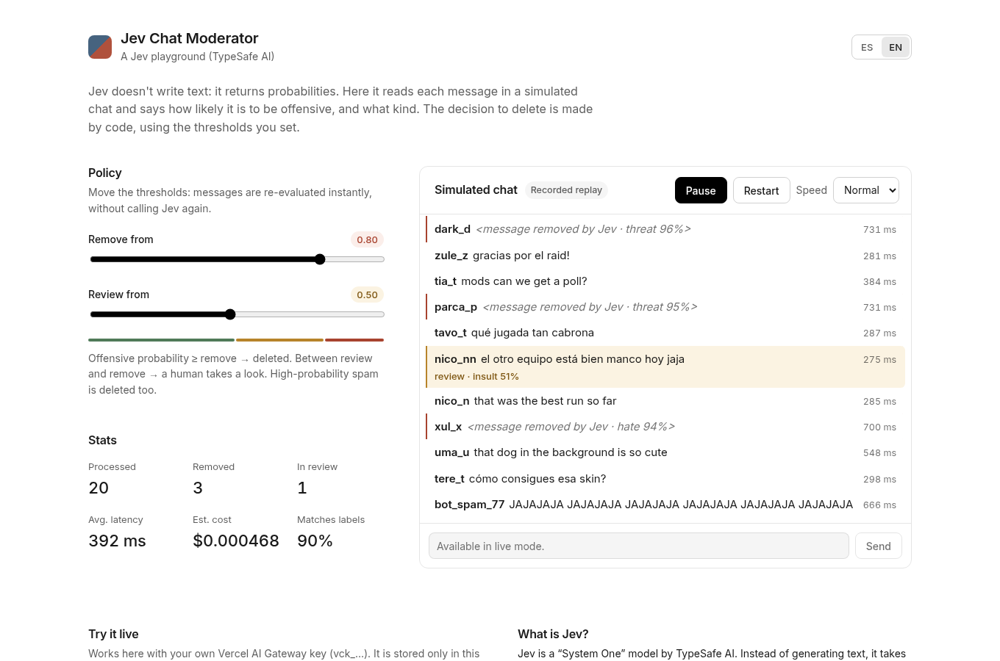

# Jev Chat Moderator

A small, open-source playground that shows [TypeSafe AI](https://typesafe.ai)'s **Jev**
moderating a simulated live-stream chat in real time.

Jev is a *System One* model: it doesn't write text. You send it some state and typed
questions, and it returns typed answers with probabilities, fast and cheap. This demo asks
two questions about every chat message in a single call:

- `offensive`: a yes/no question, answered as a probability from 0 to 1.
- `category`: one of `ok`, `insult`, `hate`, `spam` or `threat`, with a probability for
  each option.

**Jev never decides anything by itself.** The delete / review / allow decision is plain
code (`src/core/policy.ts`) applied to those probabilities. Drag the threshold sliders
and every message on screen is re-evaluated instantly, without calling Jev again.



## How it works

- **Recorded replay (default).** The published site streams ~180 scripted chat messages
  (English and Spanish; normal, ambiguous and abusive). Each message is shown with the
  answer Jev actually gave when it was recorded, including its real latency. No key is
  needed, and nobody's budget is spent.
- **Live mode (bring your own key).** Paste your own Vercel AI Gateway key (`vck_…`) or
  TypeSafe key. The key is stored only in your browser, and calls go straight from your
  browser to the provider. In live mode you can also type your own messages.

| Key | Works in the browser? |
|---|---|
| Vercel AI Gateway (`vck_…`) | Yes, the gateway allows cross-origin calls. |
| TypeSafe (`api.typesafe.ai`) | Only through a proxy, because the TypeSafe API sends no CORS headers. `pnpm dev` proxies it for you. For a deployed site, see [`proxy/`](proxy/worker.ts). |

## Run it

```bash
pnpm install
pnpm dev        # http://localhost:4321
pnpm test       # core unit tests
pnpm build      # static site in dist/
```

Re-record the replay with your own gateway key. This costs a fraction of a cent: Jev is
$0.042 per million input tokens, and output is free.

```bash
AI_GATEWAY_API_KEY=vck_... pnpm record
```

The script rewrites `src/data/replay.json` and prints how often Jev plus the default
policy agree with the hand-written labels, along with a confusion table.

## Project layout

```
src/core/      pure TypeScript, no DOM: reusable outside this site
  jev-client.ts   evaluate() for Vercel AI Gateway and TypeSafe, typed errors
  questions.ts    the two moderation questions
  moderate.ts     moderate(text) -> ModerationResult
  policy.ts       decide(result, thresholds) -> allow | review | remove
  queue.ts        tiny concurrency-limited queue (max 4 calls in flight)
src/client/    the page's behaviour (vanilla TS)
src/data/      scripted messages + recorded replay
scripts/       record.ts
proxy/         optional Cloudflare Worker that adds CORS for the TypeSafe API
```

## Deploy

A push to `main` deploys to GitHub Pages through `.github/workflows/deploy.yml`. Enable
Pages in the repo settings, with source set to *GitHub Actions*. To support TypeSafe keys
on the deployed site:
1. Deploy `proxy/` with `npx wrangler deploy`, after setting `ALLOWED_ORIGIN`.
2. Set the repository variable `PUBLIC_TYPESAFE_PROXY_URL` to the Worker's URL.

## Caveats

- Jev's strongest language is English. It handles Spanish, but with lower confidence, so
  expect more messages in the review zone.
- The scripted abuse is deliberately mild. This is a public demo, not a benchmark.

---

## En español

Playground open source: **Jev** (TypeSafe AI) moderando un chat de stream simulado.
Jev no genera texto; devuelve probabilidades. La decisión de borrar, revisar o permitir la
toma el código con los umbrales que tú ajustas. La interfaz está en español e inglés.

- **Repetición grabada:** la versión publicada usa respuestas reales de Jev grabadas una
  vez. No necesita key y no gasta presupuesto de nadie.
- **En vivo:** pega tu propia key del Vercel AI Gateway o de TypeSafe. Se guarda solo en
  tu navegador. Las keys de TypeSafe necesitan el proxy de `proxy/`, porque su API no
  permite llamadas desde el navegador.
- **Correr en local:** `pnpm install && pnpm dev`.
- **Regrabar:** `AI_GATEWAY_API_KEY=vck_... pnpm record`.

## License

MIT
