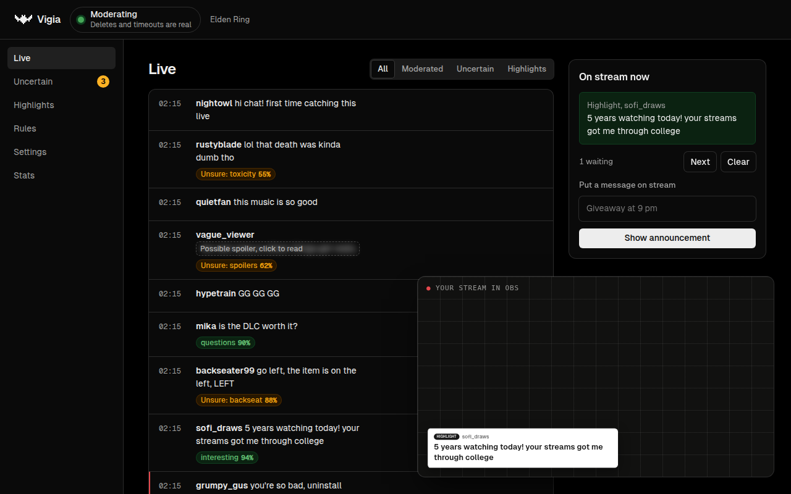

# Vigia

[Español](README.es.md) · [Website](https://vstrofago.github.io/vigia/) · [Docs](https://vstrofago.github.io/vigia/docs/en/) · [Playground](https://vstrofago.github.io/vigia/playground/)

Vigia moderates your Twitch stream's chat. It runs on your own computer and is free and open source.

- **Moderates:** deletes spam and times out insults. When it isn't sure, it leaves the message for a mod to decide.
- **Hides spoilers** for the game you're playing, including in your own dashboard.
- **Highlights questions and good messages** in an OBS overlay.

Each message is checked by Jev, a model by [TypeSafe AI](https://typesafe.ai) that answers yes-or-no questions with a probability. Your thresholds decide what happens.



> [!WARNING]
> **Experimental (v0.1.0).** Expect bugs and breaking changes.
> - Start in **observe mode**, and don't make Vigia your only moderation yet.
> - **"My channel" has not been tested with a real Twitch account yet.** "Just watch a channel" has run against real chat.
> - The installers are **unsigned**, so Windows and macOS show a warning.

## Install

Download the desktop app for Windows, macOS or Linux from [Releases](https://github.com/vstrofago/vigia/releases). A window guides you through setup in about ten minutes.

You need a Jev key (usage costs cents per night). To moderate your channel, you also need your own Twitch app, which is free. [How to get them](https://vstrofago.github.io/vigia/docs/en/keys/).

Other ways to run it: [Docker](https://vstrofago.github.io/vigia/docs/en/docker/), [a server for your mods](https://vstrofago.github.io/vigia/docs/en/server/), or [the command line](https://vstrofago.github.io/vigia/docs/en/cli/).

## Docs

- [How it decides](https://vstrofago.github.io/vigia/docs/en/how-it-works/)
- [Rules](https://vstrofago.github.io/vigia/docs/en/rules/)
- [Anti-spoiler](https://vstrofago.github.io/vigia/docs/en/anti-spoiler/)
- [Chat commands](https://vstrofago.github.io/vigia/docs/en/commands/)
- [OBS overlay](https://vstrofago.github.io/vigia/docs/en/overlay/)
- [Privacy](https://vstrofago.github.io/vigia/docs/en/privacy/)
- [Accuracy](https://vstrofago.github.io/vigia/docs/en/accuracy/)
- [FAQ](https://vstrofago.github.io/vigia/docs/en/faq/)

The docs live in [`apps/docs`](apps/docs). Run them locally with `pnpm docs`.

## Develop

```bash
pnpm install
pnpm test
pnpm typecheck
pnpm --filter @vigia/desktop start      # the desktop app from source
```

More in [Develop](https://vstrofago.github.io/vigia/docs/en/develop/). Rules, spoiler packs, translations and code are all welcome: see [CONTRIBUTING.md](CONTRIBUTING.md).

## License

MIT
